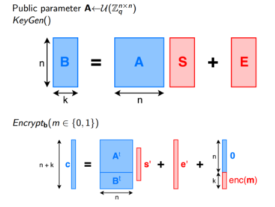
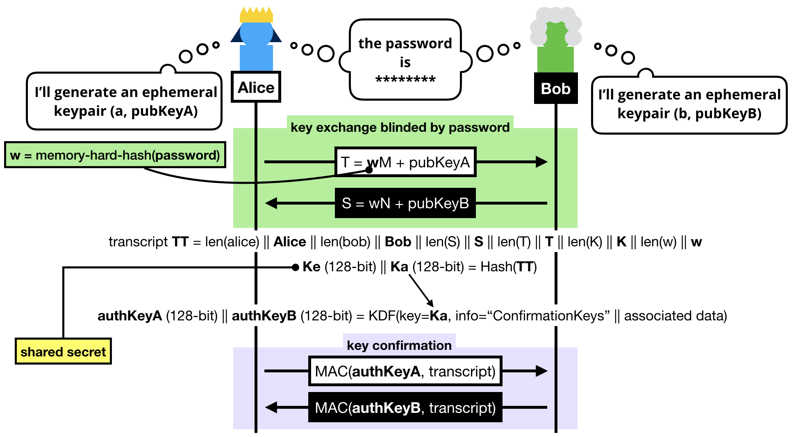
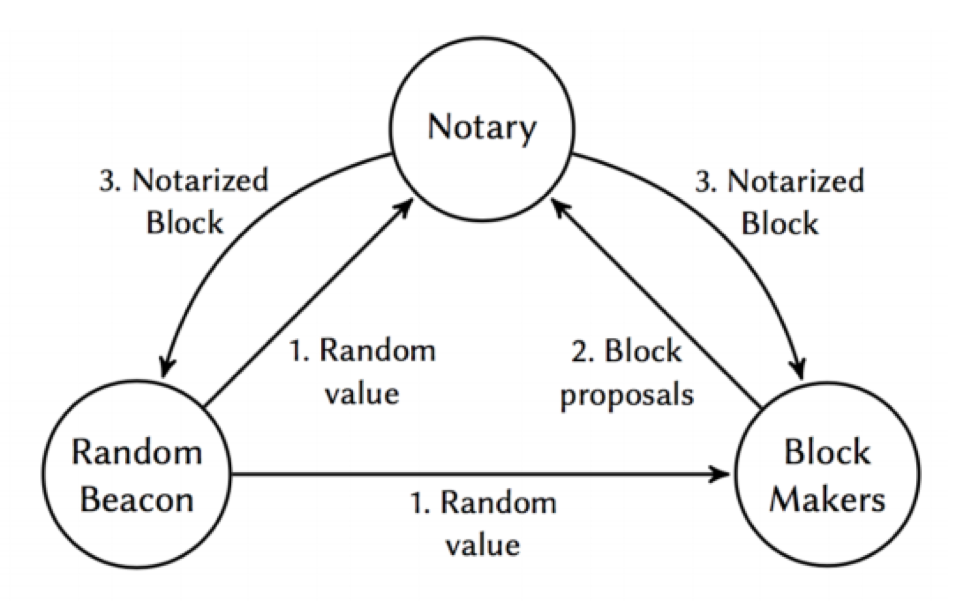

## Selected Funded Projects
Thank you to NSFC, NSFC-SD, NSFC-QD, Huawei, Tencent, and Bitmain for their generous support. 
### ongoing

- 具有鲁棒性的自适应安全门限签名构造方法研究 (Adaptive-Secure Threshold Signatures with Robustness) 
  Natural Science Foundation of China (grant No. 62472255)
- 基于隐私增强技术的口令安全认证机制研究 (Research on Password-based Authentication) 
  Natural Science Foundation of China (grant No. 62302271)
- （Sigma安全智算与认证创新团队）自适应安全门限签名的实用化构造研究 (Adaptive-Secure Threshold Signatures)  
  山东省高等学校青创科技支持计划 Youth Innovation Team of Shandong Province (grant No. 2024KJH179) 
- 基于格密码的分布式随机信标生成机制研究 (Research on Distributed Random Beacon over Lattices) 
  Natural Science Foundation of Shandong Province, China (grant No. ZR2023MF045)
- 工业互联网口令认证关键问题研究 (Research on Password-Authenticated Key Exchange for Industrial IoT) 
  Natural Science Foundation of Shandong Province, China (grant No. ZR2023QF088)
- National Key Research and Development Program of China (grant No. 2021YFA1000600) 
- CCF-腾讯犀牛鸟 智能体可信互通 

### done
- National Key Research and Development Program of China (grant No. 2022YFB2701700) 
- CCF-华为胡杨林基金可信计算 异构TEE可信互联互通
- 去中心化随机信标生成关键技术研究 (Cryptographic Techniques for Decentralized Randomness Generation) 
  Natural Science Foundation of Qingdao, China (grant No. 23-2-1-152-zyyd-jch)  
- Department of Science&Technology of Shandong Province (grant No.SYS202201) 
- Quan Cheng Laboratory (grant No. QCLZD202302) 
- 基于格基全同态加密的密文安全计算研究 (Research on Secure Computing of Encrypted Data via Lattice-Based Fully Homomorphic Encryption) No. 61802214
	National Natural Science Foundation of China, NSFC.
- 基于格的受限伪随机函数关键问题研究 (Research on Constrained PRF over lattices) No. ZR2019BF009
	National Natural Science Foundation of Shandong Province, China.
- 基于格密码的可验证伪随机函数安全计算研究 (Research on VRF over lattices) No. 19-6-2-cg
	Qingdao Applied Foundational Research Program, China

## 全同态加密与安全计算领域

 

&emsp;&emsp;数据（多方）安全计算可分为两类：（1）基于混淆电路；（2）基于同态加密。 基于混淆的多方安全计算优势在于计算开销小，但通讯开销大带宽占用高；基于同态加密的安全计算优势在于通讯开销小，但计算开销大。在当前带宽资源远贵于计算资源的困境下，采纳基于同态加密的安全计算仍存在一个根本局限：全同态加密及其安全计算耗时低效落地难。针对该限制，围绕隐私数据安全增强这一国家战略应用需求，Sigma小组从2012年开始，基于格密码和多方安全计算等交叉知识，深入研究了基于格的全同态加密及（多方）安全计算的技术。

                  
 &emsp;&emsp;（1）隐私信息检索（又称隐匿查询）：在不泄露个人查询索引（如，个人兴趣爱好）的前提下，仍获取所需查询结果。在民用领域，可应用于隐匿兴趣/某癖好的信息检索，如隐匿位置的兴趣点检索与匹配、隐匿敏感词的文本/视频检索与匹配；也可结合身份认证等技术应用于匿名信息传递（Anonymous Message Delivery）或茫然信息检索（Oblivious Message Retrieval）服务，如匿名广告投放与检索、匿名留言与检索、匿名情报采集等。
 
  

   
&emsp;&emsp;（2）隐私推理：开展可验证安全多方计算研究及产学应用。在不泄露用户私有输入数据及容忍协议性能折损的前提下，确保计算结果的正确性与可验证性，以及参与方之间的公平性等。具体包括：基于全同态加密的安全计算（密文与密文加/乘法运算以及明文与密文的乘法运算等），基于门限/多密钥全同态加密的安全多方计算。为后续安全计算应用的提供理论和技术支撑，包括隐私保护相等性检测、隐私保护距离计算以及隐私信息检索等。

 

## 密码认证与通信安全领域

 

	

   
&emsp;&emsp;身份安全认证是确保信息系统安全的第一防线。依据所使用的身份凭证与用户的关系，身份安全认证可分为三类：（1）基于用户所知，如口令；（2）基于用户所有，如U盾；（3）基于用户所是，如指纹。基于用户所知的单因素认证技术应用最为广泛，可以避免开销大的公钥基础设施，但结合认证密钥交换技术实现身份安全认证仍存在一个局限：口令认证密钥交换通讯轮次高健壮性弱应用受限。 针对该限制，围绕物理设备互联安全以及个人身份隐私增强的应用需求，Sigma小组从2016年开始，基于口令密码学等交叉知识，深入研究了基于用户所知的认证密钥交换技术在移动互联设备中的应用。包括：
 
  

   
&emsp;&emsp;（1）身份认证与端到端通信。认证密钥交换技术（AKE）在密钥交换(KE)的基础上，增加了通信双方认证彼此身份的功能，然而需要依赖于公钥基础设施（PKI）。口令认证密钥交换（PAKE）相较于AKE的优势在于无需依赖PKI，而仅通过口令(password)或指纹、步态等生物特征作为认证因子，便可认证彼此身份同时生成会话密钥建立安全信道。 围绕匿名凭证、AKE和PAKE等，针对资源受限物理设备间，开展端到端/端到服务器/群组设备等场景下身份认证与安全通信的研究，可应用于匿名Token生成、设备互联认证（如手机与百度小度、小米小爱、华为小艺之间建立安全认证）、Ad-Hoc网络环境下群组认证（如水下多传感器间、车载单元（OBU）间等）。围绕口令泄漏检测与口令固化服务，针对检测认证身份及口令信息是否泄漏问题，基于不经意伪随机函数，开展适用于网络环境下身份认证技术。
 
  

   
&emsp;&emsp;（2）远程认证。远程认证是通过发出证明请求的一方确认远程证实平台的身份和平台状态配置信息的过程,即确认远程平台是否可信的过程。计算机的变化在运行远程证明的过程中可以被证明请求者检测出，从而避免向受到安全威胁的计算机发送重要命令或私有信息。远程证明机制可用于限制客户非法应用，它针对性地选择远程执行的应用程序，可以有效的防止恶意程序或有缺陷的应用程序对服务的滥用，减少误用木马程序，并避免与恶意终端的连接，并通过这些限制达到增强终端可信和系统安全的目的。多样化的可信执行环境（TEE）方案虽然为需求方提供了更加灵活自主的选择空间，但在落地和应用的过程中，普遍存在不同架构芯片的TEE混合使用的情况，异构的TEE间无法互通，逐渐造成“孤岛”，为基于TEE的数据流转和联合计算带来了一定阻碍。着重开展异构TEE间的互联互通研究，实现数据要素更便捷的流通。

 

## 门限密码与安全多方计算领域

 

		
  
   
&emsp;&emsp;隐私通常是指个人或集体等实体不愿意被外人知道的信息，根据隐私属性的不同细分成身份隐私和数据隐私。当前隐私保护技术门类诸多，依不同需求采纳一种或多种技术协同解决，如，k匿名、差分隐私、群签名、盲签名、零知识证明等技术。课题组从2018年便开始对零知识证明、可验证随机函数、分布式密钥生成等隐私保护、安全多方计算技术开展深入研究及应用工作。具体包括：
 
  
  
  
  

   
&emsp;&emsp;（1）零知识证明。开展基于格密码的哈希证明系统（指定验证者Proof of Membership）研究工作，并讨论其应用于身份认证等领域；基于格密码的非交互零知识证明（Non-Interactive Zero-Knowledge, NIZK)的研究工作，包括采纳Rejection-sampling技术和QAP/QSP等问题的技术路线，研究zkSNARK的协议设计与应用，讨论如multiple provers, designated-verifier等情形。

  

   
&emsp;&emsp;（2）安全多方计算。重点开展可验证秘密共享、分布式密钥生成和去中心化可信随机数生成的研究，并应用于分布式账本或分布式安全计算中。门限密码学（如，加性秘密共享和Shamir秘密共享）是实现安全多方计算的基础必要工具，课题组结合同态加密和零知识证明等基础密码学原语，围绕可验证秘密共享、公开可验证秘密共享以及前摄性秘密共享等技术，分别开展分布式密钥生成与去中心化随机信标生成研究，并应用于门限签名，隐私领导者选举，公平性安全多方计算等。

  

   
&emsp;&emsp;（3）门限签名。分别开展门限ECDSA、门限Schnorr、门限BLS等签名研究，结合零知识证明等，针对区块链钱包等安全问题，开展区块链钱包密钥的安全存储与更新研究。

## Publications

 Generally, the list our publications can be found on <a href="http://dblp.uni-trier.de/pers/hd/l/Li:Zengpeng" target="_blank">DBLP</a>,
<a href="https://www.researchgate.net/profile/Zengpeng_Li2" target="_blank">Researchgate</a>,
<a href="https://scholar.google.com/citations?hl=en&user=_Jtom6EAAAAJ&sortby=pubdate&view_op=list_works&authuser=1&gmla=AJsN-F53hRqBJRJ8H3xMA9KpBnoBKxQDcy36a0z5ouz5Ckvh7QPR_jOrblWBxUQRTGyhJqFiJ07DiAX-w_sJUxGIQKURRIFShcDwyqw8jwku9NVu8G42muM" target="_blank">Schloar</a>, <a href="https://ieeexplore.ieee.org/search/searchresult.jsp?newsearch=true&searchWithin=%22First%20Name%22:zengpeng&searchWithin=%22Last%20Name%22:li" target="_blank">IEEE</a>, and
<a href="https://apps.webofknowledge.com/Search.do?product=WOS&SID=E1VnZkfIn9cRPBvaDLr&search_mode=GeneralSearch&prID=e8389f2d-e8aa-4621-8300-7d9c13337e59" target="_blank">Web of Science</a>.

### ongoing
- GreatSage: Securing Authentication with Anonymous Access Tokens
- KAME: Privacy-Preserving Proximity Test
- MPC-Friendly Key (and Randomness) Generation for Dynamic-Committee
- Blind-Envoy: Magical Private Message Service

### 2023
- [Funder: Future-Proof Unbiased Decentralized Randomness](https://ieeexplore.ieee.org/stamp/stamp.jsp?tp=&arnumber=10297306&tag=1)  
  Zengpeng Li, Mei Wang, Teik Guan Tan, Jianying Zhou. IEEE Internet of Things Journal(2023)
  

    
BibTex

      

      @ARTICLE{10297306, 
      author={Li, Zengpeng and Wang, Mei and Tan, Teik Guan and Zhou, Jianying}, 
      journal={IEEE Internet of Things Journal},  
      title={Funder: Future-Proof Unbiased Decentralized Randomness},  
      year={2023}, 
      volume={}, 
      number={}, 
      pages={1-1}, 
      doi={10.1109/JIOT.2023.3327733} 
        } 
      

  

- [QR-PUF: Design and Implementation of a RFID-Based Secure Inpatient Management System Using XOR-Arbiter-PUF and QR-Code](https://ieeexplore.ieee.org/stamp/stamp.jsp?tp=&arnumber=9807448)  
  Prosanta Gope, Yuening Wang, Zengpeng Li, Biplab Sikdar. IEEE Transactions on Network Science and Engineering(2023)
  

    
BibTex

      

      @ARTICLE{9807448, 
      author={Gope, Prosanta and Wang, Yuening and Li, Zengpeng and Sikdar, Biplab}, 
      journal={IEEE Transactions on Network Science and Engineering},  
      title={QR-PUF: Design and Implementation of a RFID-Based Secure Inpatient Management System Using XOR-Arbiter-PUF and QR-Code},  
      year={2023}, 
      volume={10}, 
      number={5}, 
      pages={2637-2650}, 
      doi={10.1109/TNSE.2022.3186478} 
        } 
      

  

- [Controlled Search: Building Inverted-Index PEKS with Less Leakage in Multi-User Setting](https://ieeexplore.ieee.org/stamp/stamp.jsp?tp=&arnumber=10155288)  
  Guiyun Qin, Pengtao Liu, Chengyu Hu, Zengpeng Li, Shanqing Guo. IEEE Internet of Things Journal(2023)
  

    
BibTex

      

      @ARTICLE{10155288, 
      author={Qin, Guiyun and Liu, Pengtao and Hu, Chengyu and Li, Zengpeng and Guo, Shanqing}, 
      journal={IEEE Internet of Things Journal},  
      title={Controlled Search: Building Inverted-Index PEKS with Less Leakage in Multi-User Setting},  
      year={2023}, 
      volume={}, 
      number={}, 
      pages={1-1}, 
      doi={10.1109/JIOT.2023.3287353} 
        } 
      

  

- [Retrieval Transformation: Dynamic Searchable Symmetric Encryption With Strong Security](https://ieeexplore.ieee.org/stamp/stamp.jsp?tp=&arnumber=10287254)  
  Guiyun Qin, Pengtao Liu, Chengyu Hu, Zengpeng Li, Shanqing Guo. IEEE Systems Journal(2023)
  

    
BibTex

      

      @ARTICLE{10287254, 
      author={Qin, Guiyun and Liu, Pengtao and Hu, Chengyu and Li, Zengpeng and Guo, Shanqing}, 
      journal={IEEE Systems Journal},  
      title={Retrieval Transformation: Dynamic Searchable Symmetric Encryption With Strong Security},  
      year={2023}, 
      volume={}, 
      number={}, 
      pages={1-12}, 
      doi={10.1109/JSYST.2023.3288052} 
        } 
      

  

- [新形态伪随机函数研究](http://netinfo-security.org/CN/10.3969/j.issn.1671-1122.2023.05.002)  
  李增鹏,王梅,陈梦佳. 信息网络安全 (2023)  
  

    
BibTex

      

      @article{李增鹏:11,   
      author = {李增鹏, 王梅, 陈梦佳},   
      title = {新形态伪随机函数研究},   
      publisher = {信息网络安全},   
      year = {2023},   
      journal = {信息网络安全},   
      volume = {23},   
      number = {5},   
      eid = {11},   
      numpages = {10},   
      pages = {11},   
      keywords = {;格基密码学;全同态加密;安全多方计算;伪随机函数;密文安全计算},   
      url = {http://netinfo-security.org/CN/abstract/article_7617.shtml},   
      doi = {10.3969/j.issn.1671-1122.2023.05.002}   
      }   
      
  
  

- [Security Authentication Protocol for Massive Machine Type Communication in 5G Networks](https://doi.org/10.1155/2023/6086686)  
  Junfeng Miao, Zhaoshun Wang, Mei Wang, Xiao Feng, Nan Xiao, Xiaoxue Sun, Chenglu Jin.  Wireless Communications & Mobile Computing (2023)  
  

    
BibTex

      

      @article{10.1155/2023/6086686,  
      author = {Miao, Junfeng and Wang, Zhaoshun and Wang, Mei and Feng, Xiao and Xiao, Nan and Sun, Xiaoxue and Jin, Chenglu},  
      title = {Security Authentication Protocol for Massive Machine Type Communication in 5G Networks},  
      year = {2023},  
      issue_date = {2023},  
      publisher = {John Wiley and Sons Ltd.},  
      address = {GBR},  
      volume = {2023},  
      issn = {1530-8669},  
      url = {https://doi.org/10.1155/2023/6086686},  
      doi = {10.1155/2023/6086686},  
      }  
      

  

### 2022

- [PANDA: Lightweight non-interactive privacy-preserving data aggregation for constrained devices](https://www.sciencedirect.com/science/article/abs/pii/S0167739X22000152)  
  Mei Wang, Kun He, Jing Chen, Ruiying Du, Bingsheng Zhang, Zengpeng Li. Future Generation Computer Systems (2022)  
  

    
BibTex

      

      @article{WANG202228,  
      title = {PANDA: Lightweight non-interactive privacy-preserving data aggregation for constrained devices},  
      journal = {Future Generation Computer Systems},  
      volume = {131},  
      pages = {28-42},  
      year = {2022},  
      issn = {0167-739X},  
      doi = {https://doi.org/10.1016/j.future.2022.01.007},  
      url = {https://www.sciencedirect.com/science/article/pii/S0167739X22000152},  
      author = {Mei Wang and Kun He and Jing Chen and Ruiying Du and Bingsheng Zhang and Zengpeng Li},  
      keywords = {Privacy-preserving data aggregation, Trusted Execution Environment}  
      }  
      

  

- [Quantum-Safe Round-Optimal Password Authentication for Mobile Devices](https://ieeexplore.ieee.org/abstract/document/9272675)  
  Zengpeng Li, Ding Wang, Eduardo Morais. IEEE Transactions on Dependable and Secure Computing (2022)  
  

    
BibTex

      

      @ARTICLE{9272675,  
        author={Li, Zengpeng and Wang, Ding and Morais, Eduardo},  
        journal={IEEE Transactions on Dependable and Secure Computing},   
        title={Quantum-Safe Round-Optimal Password Authentication for Mobile Devices},   
        year={2022},  
        volume={19},  
        number={3},  
        pages={1885-1899},  
        doi={10.1109/TDSC.2020.3040776}}  
      

  

- [Achieving One-Round Password-Based Authenticated Key Exchange over Lattices](https://ieeexplore.ieee.org/document/8826379)  
  Zengpeng Li, Ding Wang.  IEEE Transactions on Services Computing (2022)  
  

    
BibTex

      

      @ARTICLE{8826379,  
        author={Li, Zengpeng and Wang, Ding},  
        journal={IEEE Transactions on Services Computing},   
        title={Achieving One-Round Password-Based Authenticated Key Exchange over Lattices},   
        year={2022},  
        volume={15},  
        number={1},  
        pages={308-321},  
        doi={10.1109/TSC.2019.2939836}}  
      

  

### 2021

- [Biometrics-Authenticated Key Exchange for Secure Messaging](https://dl.acm.org/doi/10.1145/3460120.3484746)  
  Mei Wang, Kun He, Jing Chen, Zengpeng Li, Wei Zhao, Ruiying Du.  ACM CCS (2021)   
  

    
BibTex

      

      @inproceedings{10.1145/3460120.3484746,  
      author = {Wang, Mei and He, Kun and Chen, Jing and Li, Zengpeng and Zhao, Wei and Du, Ruiying},  
      title = {Biometrics-Authenticated Key Exchange for Secure Messaging},  
      year = {2021},  
      isbn = {9781450384544},  
      publisher = {Association for Computing Machinery},  
      address = {New York, NY, USA},  
      url = {https://doi.org/10.1145/3460120.3484746},  
      doi = {10.1145/3460120.3484746},  
      }  
      

  

 

- [PriParkRec: Privacy-Preserving Decentralized Parking Recommendation Services](https://www.researchgate.net/publication/346204383_Quantum-Safe_Round-Optimal_Password_Authentication_for_Mobile_Devices?_sg=OUGmCcXIq01s6l6akPZ2t8olIigA8tNgAwF8q9AIVZY90GscO-CX1hzyTd-ca_WTs2crGi6jw5JrTo6w3GrGQq7ZYkYWP3jHszywuTbp.w5GSF97r1gwm28V0CFn3_dTgxROL8WApDAIBhNlzPSaPCCc0UlMidVRlQlkKKRIDtbldpCeBRpd7RaHGBBNJaA)  
  Zengpeng Li, Mamoun Alazab, Sahil Garg, M. Shamim Hossain. IEEE Transactions on Vehicular Technology (2021)  
  

    
BibTex

      

      @ARTICLE{9427358,  
        author={Li, Zengpeng and Alazab, Mamoun and Garg, Sahil and Hossain, M. Shamim},  
        journal={IEEE Transactions on Vehicular Technology},   
        title={PriParkRec: Privacy-Preserving Decentralized Parking Recommendation Service},   
        year={2021},  
        volume={70},  
        number={5},  
        pages={4037-4050},  
        doi={10.1109/TVT.2021.3074820}}  
      

  

- [Building Low-Interactivity Multifactor Authenticated Key Exchange for Industrial Internet of Things](https://ieeexplore.ieee.org/document/9139491)  
  Zengpeng Li, Zheng Yang, Pawel Szalachowski, Jianying Zhou. IEEE Internet of Things Journal (2021)  
  

    
BibTex

      

      @ARTICLE{9139491,  
        author={Li, Zengpeng and Yang, Zheng and Szalachowski, Pawel and Zhou, Jianying},  
        journal={IEEE Internet of Things Journal},   
        title={Building Low-Interactivity Multifactor Authenticated Key Exchange for Industrial Internet of Things},   
        year={2021},  
        volume={8},  
        number={2},  
        pages={844-859},  
        doi={10.1109/JIOT.2020.3008773}}  
      

  

- [Towards Achieving Keyword Search over Dynamic Encrypted Cloud Data with Symmetric-Key Based Verification](https://ieeexplore.ieee.org/document/8630039)  
  Xinrui Ge, Jia Yu, Hanlin Zhang, Chengyu Hu, Zengpeng Li, Zhan Qin, Rong Hao. IEEE Transactions on Dependable and Secure Computing (2021).  
  

    
BibTex

      

      @ARTICLE{8630039,  
        author={Ge, Xinrui and Yu, Jia and Zhang, Hanlin and Hu, Chengyu and Li, Zengpeng and Qin, Zhan and Hao, Rong},  
        journal={IEEE Transactions on Dependable and Secure Computing},   
        title={Towards Achieving Keyword Search over Dynamic Encrypted Cloud Data with Symmetric-Key Based Verification},   
        year={2021},  
        volume={18},  
        number={1},  
        pages={490-504},  
        doi={10.1109/TDSC.2019.2896258}}  
      

  

- [基于格的口令散列方案](https://kns.cnki.net/kcms2/article/abstract?v=3uoqIhG8C44YLTlOAiTRKibYlV5Vjs7iy_Rpms2pqwbFRRUtoUImHZFZ--gDK-DMWNhX2H80o0YXRmgj-dLd9L9U8cvctUxr&uniplatform=NZKPT)  
  李增鹏,汪定. 中国科学:信息科学,2021,51(08):1375-1390  
  

    
BibTex

      

      @article{李增鹏2021基于格的口令散列方案,  
        title={基于格的口令散列方案},  
        author={李增鹏 and 汪定},  
        journal={中国科学：信息科学}, 
        number={051-008},  
        year={2021},  
      }  
      

  

### 2020

- [Quantum-Safe Round-Optimal Password Authentication for Mobile Devices](https://www.researchgate.net/publication/346204383_Quantum-Safe_Round-Optimal_Password_Authentication_for_Mobile_Devices)  
  Zengpeng Li, Ding Wang, and Eduardo Morais. IEEE Transactions on Dependable and Secure Computing (2020).  
  

    
BibTex

      

      @ARTICLE{9272675,  
        author={Li, Zengpeng and Wang, Ding and Morais, Eduardo},  
        journal={IEEE Transactions on Dependable and Secure Computing},   
        title={Quantum-Safe Round-Optimal Password Authentication for Mobile Devices},   
        year={2022},  
        volume={19},  
        number={3},  
        pages={1885-1899},  
        doi={10.1109/TDSC.2020.3040776}}  
      

  

- [Building Low-Interactivity Multi-Factor Authenticated Key Exchange for Industrial Internet-of-Things](https://www.researchgate.net/publication/341083165_Preserving_Data_Privacy_via_Federated_Learning_Challenges_and_Solutions)  
  Zengpeng Li, Zheng Yang, Pawel Szalachowsk, and Jianying Zhou. IEEE Internet of Things Journal (2020).  
  

    
BibTex

      

      @ARTICLE{9139491,  
        author={Li, Zengpeng and Yang, Zheng and Szalachowski, Pawel and Zhou, Jianying},  
        journal={IEEE Internet of Things Journal},   
        title={Building Low-Interactivity Multifactor Authenticated Key Exchange for Industrial Internet of Things},   
        year={2021},  
        volume={8},  
        number={2},  
        pages={844-859},  
        doi={10.1109/JIOT.2020.3008773}}  
      

  

- [Preserving Data Privacy via Federated Learning: Challenges and Solutions](https://ieeexplore.ieee.org/document/9055478/)  
  Zengpeng Li, Vishal Sharma, and Saraju P. Mohanty. IEEE Consumer Electronics Magazine (2020).  
  

    
BibTex

      

      @article{2020Preserving,  
        title={Preserving Data Privacy via Federated Learning: Challenges and Solutions},  
        author={ Li, Z.  and  Sharma, V.  and  Mohanty, S. P. },  
        journal={IEEE Consumer Electronics Magazine},  
        volume={9},  
        number={3},  
        pages={8-16},  
        year={2020},  
      }  
      

  

- [Ciphertext-Policy Attribute-Based Proxy Re-Encryption via Constrained PRFs](https://www.sciengine.com/SCIS/doi/10.1007/s11432-019-2856-8)  
  Zengpeng Li, Vishal Sharma, Chunguang Ma, Chunpeng Ge, and Willy Susilo. SCIENCE CHINA Information Sciences (2020).  
  

    
BibTex

      

      @article{SCIS:LSMGS20,  
      author = {Zengpeng Li and Vishal Sharma and Chunguang Ma and Chunpeng Ge, and Willy Susilo},  
      title = {Ciphertext-Policy Attribute-Based Proxy Re-Encryption via Constrained PRFs},  
      journal = {SCIENCE CHINA Information Sciences},  
      volume = {64},  
      number = {6},  
      pages = {169301:1--169301:2},  
      year = {2021},  
      url = {https://doi.org/10.1007/s11432-019-2856-8},  
      doi = {10.1007/s11432-019-2856-8},  
      }  
      

  

- [Multi-Factor Password-Authenticated Key Exchange via Pythia PRF Service](https://www.techscience.com/cmc/v63n2/38536)  
  Zengpeng Li, Jiuru Wang, Chang Choi, and Wenyin Zhan. Computers, Materials & Continua (2020).  
  

    
BibTex

      

      @article{CMC:LWCZ19,  
      AUTHOR = {Zengpeng Li and Jiuru Wang and Chang Choi and Wenyin Zhang},  
      TITLE = {Multi-Factor Password-Authenticated Key Exchange via Pythia PRF Service},  
      JOURNAL = {Computers, Materials \& Continua},  
      VOLUME = {63},  
      YEAR = {2020},  
      NUMBER = {2},  
      PAGES = {663--674},  
      URL = {http://www.techscience.com/cmc/v63n2/38536},  
      DOI = {10.32604/cmc.2020.06565}  
      }  
      

  

- [SecDedup: Secure Encrypted Data Deduplication With Dynamic Ownership Updating](https://ieeexplore.ieee.org/document/9194768)  
  Shuguang Zhang, Hequn Xian, Zengpeng Li, Liming Wang. IEEE Access (2020).  
  

    
BibTex

      

      @ARTICLE{9194768,  
        author={Zhang, Shuguang and Xian, Hequn and Li, Zengpeng and Wang, Liming},  
        journal={IEEE Access},   
        title={SecDedup: Secure Encrypted Data Deduplication With Dynamic Ownership Updating},   
        year={2020},  
        volume={8},  
        number={},  
        pages={186323-186334},  
        doi={10.1109/ACCESS.2020.3023387}}  
      

  

- [一种基于对偶Regev加密的门限公钥加密方案](https://journal.bupt.edu.cn/CN/abstract/abstract4653.shtml)  
  李增鹏,王九如,张问银. 北京邮电大学学报,2020,43(04):83-87.DOI:10.13190/j.jbupt.2019-239.  
  

    
BibTex

      

      @article{ 马春光:83,  
      author = {[ 马春光,  王九如,  张问银, 李增鹏]},  
      title = {一种基于对偶Regev加密的门限公钥加密方案},  
      publisher = {北京邮电大学学报},  
      year = {2020},  
      journal = {北京邮电大学学报},  
      volume = {43},  
      number = {4},  
      eid = {83},  
      pages = {83-87},  
      keywords = {格基密码学;门限密码;容错学习;安全协议},  
      doi = https://journal.bupt.edu.cn/CN/10.13190/j.jbupt.2019-239  
      }  
      

  

### 2019

- [Achieving One-Round Password-based Authenticated Key Exchange over Lattices](https://www.researchgate.net/publication/335542873_Achieving_One-Round_Password-based_Authenticated_Key_Exchange_over_Lattices)  
  Zengpeng Li and Ding Wang. IEEE Transactions on Services Computing 2019.  
  

    
BibTex

      

      @ARTICLE{8826379,  
        author={Li, Zengpeng and Wang, Ding},  
        journal={IEEE Transactions on Services Computing},   
        title={Achieving One-Round Password-Based Authenticated Key Exchange over Lattices},   
        year={2022},  
        volume={15},  
        number={1},  
        pages={308-321},  
        doi={10.1109/TSC.2019.2939836}}  
      

  

- [Revisiting post-quantum hash proof systems over lattices for Internet of Thing authentications](https://www.researchgate.net/publication/336450331_Revisiting_post-quantum_hash_proof_systems_over_lattices_for_Internet_of_Thing_authentications)  
  Zengpeng Li, Jiuru Wang, and Wenyin Zhang. Journal of Ambient Intelligence and Humanized Computing (2019).  
  

    
BibTex

      

      @article{JCIE:LMZC19,  
      author = {Zengpeng Li and Chunguang Ma and Minghao Zhao and Chang Choi},  
      title = {Revisiting post-quantum hash proof systems over lattices for Internet of Thing authentications},  
      journal = {J Ambient Intell Human Comput},  
      year = {2019},  
      doi = {10.1007/s12652-019-01529-2},  
      URL = {https://doi.org/10.1007/s12652-019-01529-2},  
      }  
      

  

- [Efficient oblivious transfer construction via multiple bits dual-mode cryptosystem for secure selection in the cloud](https://www.researchgate.net/publication/331241984_Efficient_oblivious_transfer_construction_via_multiple_bits_dual-mode_cryptosystem_for_secure_selection_in_the_cloud?_sg=cmgzHQWg2IckyUEnusgOiAfsHTasfqfaDvyGgOFNtNlSMipCDjJPiAVOzei6VRLG7FZPsch1HAbyXR-DWkkrBonTQ2eS8NaZ78TvKEG9.6lWJio5ljjP7bkFxVms8QQ5dNQOpmjXkXn9wHIsM1NUpfuscbB4thdDj33ySigFE2PcPg6iZLJJiXekHPdosCw)  
  Zengpeng Li, Chunguang Ma, Minghao Zhao, and Chang Choi. Journal of the Chinese Institute of Engineers (2019).  
  

    
BibTex

      

      @article{JCIE:LMZC19,  
      author = {Zengpeng Li and Chunguang Ma and Minghao Zhao and Chang Choi},  
      title = {Efficient oblivious transfer construction via multiple bits dual-mode cryptosystem for secure selection in the cloud},  
      journal = {Journal of the Chinese Institute of Engineers},  
      volume = {42},  
      number = {1},  
      pages = {97-106},  
      year = {2019},  
      publisher = {Taylor \& Francis},  
      doi = {10.1080/02533839.2018.1537809},  
      URL = {https://doi.org/10.1080/02533839.2018.1537809},  
      eprint = {https://doi.org/10.1080/02533839.2018.1537809},  
      }  
      

  

- [抵抗自适应密钥恢复攻击的层级全同态加密](https://kns.cnki.net/kcms2/article/abstract?v=3uoqIhG8C44YLTlOAiTRKibYlV5Vjs7iLik5jEcCI09uHa3oBxtWoC8rj65ZR0pFE-DZ9T3k050BspoxlOKTFkcAYnWKsTDl&uniplatform=NZKPT)  
  李增鹏,马春光,赵明昊. 计算机研究与发展,2019,56(03):496-507.  
  

    
BibTex

      

      @article{李增鹏2019抵抗自适应密钥恢复攻击的层级全同态加密,  
        title={抵抗自适应密钥恢复攻击的层级全同态加密},  
        author={李增鹏 and 马春光 and 赵明昊},  
        journal={计算机研究与发展},  
        volume={56},  
        number={3},  
        pages={12},  
        year={2019},  
      }  
      

  

### 2018

- [Oblivious Transfer via Lossy Encryption from Lattice-Based Cryptography](https://www.researchgate.net/publication/327391129_Oblivious_Transfer_via_Lossy_Encryption_from_Lattice-Based_Cryptography)  
  Zengpeng Li, Can Xiang, and Chenyu Wang. Wireless Communications and Mobile Computing 2018: 5973285:1-5973285:11 (2018).  
  

    
BibTex

      

      @article{WCMC:LiXiaWan18,  
      author = {Zengpeng Li, Can Xiang, and Chenyu Wang},  
      title = {Oblivious Transfer via Lossy Encryption from Lattice-Based Cryptography},  
      journal = {Wireless Communications and Mobile Computin},  
      volume = {2018},  
      pages = {5973285:1--5973285:11},  
      year = {2018},  
      url = {https://doi.org/10.1155/2018/5973285},  
      doi = {10.1155/2018/5973285},  
      }  
      

  

- [Multi-Key FHE on Multi-Bit Messages](https://link.springer.com/content/pdf/10.1007/s11432-017-9206-y.pdf)  
  Zengpeng Li, Chunguang Ma and Hong-Sheng Zhou. SCIENCE CHINA Information Sciences 2018.  
  

    
BibTex

      

      @article{2018Multi,  
        title={Multi-Key FHE on Multi-Bit Messages},  
        author={ Zengpeng, L. I.  and  Chunguang, M. A.  and  Zhou, Hongsheng },  
        journal={中国科学：信息科学（英文版）},  
        volume={61},  
        number={2},  
        pages={3},  
        year={2018},  
      }  
      

  

- [Two-Round PAKE Protocol over Lattices Without NIZK](https://www.researchgate.net/publication/331228008_Two-Round_PAKE_Protocol_over_Lattices_Without_NIZK_14th_International_Conference_Inscrypt_2018_Fuzhou_China_December_14-17_2018_Revised_Selected_Papers)  
  Zengpeng Li and Ding Wang. Inscrypt 2018 (Best Paper Award (2/81)).  
  

    
BibTex

      

      @inproceedings{INscrypt:LiWan18,  
      author = {Zengpeng Li and Ding Wang},  
      title = {Two-Round {PAKE} Protocol over Lattices Without {NIZK}},  
      booktitle = {Information Security and Cryptology - 14th International Conference, Inscrypt 2018, Fuzhou, China, December 14-17, 2018, Revised Selected Papers},  
      series = {Lecture Notes in Computer Science},  
      volume = {11449},  
      pages = {138--159},  
      publisher = {Springer},  
      year = {2018},  
      }  
      

  

### 2017

- [Achieving Multi-Hop PRE via Branching Program](https://ieeexplore.ieee.org/document/8070989/)  
  Zengpeng Li, Chunguang Ma and Ding Wang. IEEE Transactions on Cloud Computing, 2017.  
  

   
BibTex

      

      @article{TCC:LiMaWan17,  
      author = {Zengpeng Li and Chunguang Ma and Ding Wang},  
      title = {Achieving Multi-Hop PRE via Branching Program},  
      journal = {IEEE Transactions on Cloud Computing},  
      year = {2017},  
      url = {https://doi.org/10.1109/TCC.2017.2764082},  
      doi = {10.1109/TCC.2017.2764082},  
      }  
      

  

- [Leakage Resilient Leveled FHE on Multiple Bit Message](https://ieeexplore.ieee.org/document/7979612/)  
  Zengpeng Li, Chunguang Ma and Ding Wang. IEEE Transactions on Big Data, 2017.  
  

    
BibTex

      

      @article{TBD:LiMaWan17,  
      author = {Zengpeng Li and Chunguang Ma and Ding Wang},  
      title = {Leakage Resilient Leveled FHE on Multiple Bit Message},  
      journal = {IEEE Transactions on Big Data},  
      year = {2017},  
      url = {https://doi.org/10.1109/TBDATA.2017.2726554},  
      doi = {10.1109/TBDATA.2017.2726554},  
      }  
      

  

- [Towards Multi-Hop Homomorphic Identity-Based Proxy Re-Encryption via Branching Program](https://ieeexplore.ieee.org/abstract/document/8012380)  
  Zengpeng Li, Chunguang Ma and Ding Wang. IEEE Access 2017.  
  

    
BibTex

      

      @article{2017Towards,  
        title={Towards Multi-Hop Homomorphic Identity-Based Proxy Re-Encryption via Branching Program},  
        author={ Li, Z.  and  Ma, C.  and  Ding, W. },  
        journal={IEEE Access},  
        volume={5},  
        number={99},  
        pages={16214-16228},  
        year={2017},  
      }  
      

  

- [Toward single-server private information retrieval protocol via learning with errors](https://www.researchgate.net/publication/311589741_Toward_single-server_private_information_retrieval_protocol_via_learning_with_errors)  
  Zengpeng Li, Chunguang Ma, Ding Wang, and Gang Du. Journal of Information Security and Applications. 34: 280-284 (2017).  
  

    
BibTex

      

      @article{JISA:LMWD17,  
      author = {Zengpeng Li and Chunguang Ma and Ding Wang and Gang Du},  
      title = {Toward single-server private information retrieval protocol via learning with errors},  
      journal = {J. Inf. Secur. Appl.},  
      volume = {34},  
      pages = {280--284},  
      year = {2017},  
      url = {https://doi.org/10.1016/j.jisa.2016.11.003},  
      doi = {10.1016/j.jisa.2016.11.003},  
      }  
      

  

- [Toward Proxy Re-encryption From Learning with Errors in the Exponent](https://ieeexplore.ieee.org/document/8029503/)  
  Zengpeng Li, Chunguang Ma, Ding Wang, Minghao Zhao, Qian Zhao and Lu Zhou.  Trustcom 2017.  
  

    
BibTex

      

      @inproceedings{2017Toward,  
        title={Toward Proxy Re-encryption From Learning with Errors in the Exponent},  
        author={ Li, Z.  and  Ma, C.  and  Ding, W.  and  Zhao, M.  and  Lu, Z. },  
        booktitle={2017 IEEE Trustcom/BigDataSE/ICESS},  
        year={2017},  
      }
      

  

- [全同态加密研究](https://kns.cnki.net/kcms2/article/abstract?v=3uoqIhG8C44YLTlOAiTRKibYlV5Vjs7i0-kJR0HYBJ80QN9L51zrP5OXi0gz2N2x4MEAA8sR0vkE6YYywPhp53-n1XnjG-Dt&uniplatform=NZKPT)  
  李增鹏,马春光,周红生. 密码学报,2017,4(06):561-578.DOI:10.13868/j.cnki.jcr.000208.  
  

    
BibTex

      

      @article{李增鹏2017全同态加密研究,  
        title={全同态加密研究},  
        author={李增鹏 and 马春光 and 周红生},  
        journal={密码学报},  
        number={6},  
        pages={18},  
        year={2017},  
      }  
      

  

- [两类基于容错学习的多比特格公钥加密方案](https://kns.cnki.net/kcms2/article/abstract?v=3uoqIhG8C44YLTlOAiTRKibYlV5Vjs7iAEhECQAQ9aTiC5BjCgn0Rjc-0zcVP9Lyztn0gTWvTRl2kYG99XMnMTrB_c6Jl0Bb&uniplatform=NZKPT)  
  李增鹏,马春光,张磊. 信息网络安全,2017,No.202(10):1-7.  
  

    
BibTex

      

      @article{李增鹏:1,  
      author = {李增鹏, 马春光, 张磊, 张雯雯},  
      title = {两类基于容错学习的多比特格公钥加密方案},  
      publisher = {信息网络安全},  
      year = {2017},  
      journal = {信息网络安全},  
      volume = {17},  
      number = {10},  
      eid = {1},  
      numpages = {6},  
      pages = {1},  
      keywords = {格基密码;容错学习;多比特加密;全同态加密},  
      url = {http://netinfo-security.org/CN/abstract/article_6453.shtml},  
      doi = {10.3969/j.issn.1671-1122.2017.10.001}  
      }      
      

  

### 2016

- [Multi-bit Leveled Homomorphic Encryption via Dual.LWE-Based](https://link.springer.com/chapter/10.1007/978-3-319-54705-3_14)  
  Zengpeng Li, Chunguang Ma, Eduardo Morais and Gang Du. In Inscrypt 2016.  
  

    
BibTex

      

      @inproceedings{Inscrypt:LMMD16,  
      author = {Zengpeng Li and Chunguang Ma and Eduardo Morais and Gang Du},  
      title = {Multi-bit Leveled Homomorphic Encryption via Dual.LWE -Based},  
      booktitle = {Information Security and Cryptology - 12th International Conference, Inscrypt 2016, Beijing, China, November 4-6, 2016, Revised Selected Papers},  
      series = {Lecture Notes in Computer Science},  
      volume = {10143},  
      pages = {221--242},  
      publisher = {Springer},  
      year = {2016},  
      }  
      

  

- [Dual LWE-Based Fully Homomorphic Encryption with Errorless Key Switching](https://link.springer.com/chapter/10.1007/978-3-319-54705-3_14)  
  Zengpeng Li, Chunguang Ma, Gang Du, Weiping Ouyang. ICPADS 2016.  
  

    
BibTex

      

      @inproceedings{2016Dual,  
        title={Dual LWE-Based Fully Homomorphic Encryption with Errorless Key Switching},  
        author={ Li, Z.  and  Ma, C.  and  Gang, D.  and  Ouyang, W. },  
        booktitle={IEEE International Conference on Parallel & Distributed Systems},  
        year={2016},  
      }  
      

  

- [Preventing Adaptive Key Recovery Attacks on the GSW Levelled Homomorphic Encryption Scheme](https://link.springer.com/chapter/10.1007/978-3-319-54705-3_14)  
  Zengpeng Li, Steven D. Galbraith, and Chunguang Ma. Provsec 2016.  
  

    
BibTex

      
  
    @inproceedings{Provsec:LiGalMa16,  
    author = {Zengpeng Li and Steven D. Galbraith and Chunguang Ma},  
    title = {Preventing Adaptive Key Recovery Attacks on the GSW Levelled Homomorphic Encryption Scheme},  
    booktitle = {Provable Security - 10th International Conference, ProvSec 2016, Nanjing, China, November 10-11, 2016, Proceedings},  
    series = {Lecture Notes in Computer Science},  
    volume = {10005},  
    pages = {373--383},  
    year = {2016},  
    url = {https://doi.org/10.1007/978-3-319-47422-9\_22},  
    doi = {10.1007/978-3-319-47422-9\_22},  
    }  
    

  

## [Patent](https://www.patentguru.com/cn/inventor/%E6%9D%8E%E5%A2%9E%E9%B9%8F?q=%E5%B1%B1%E4%B8%9C%E5%A4%A7%E5%AD%A6)
- 李增鹏, 崔浩宇, 王梅, 王书超, 王思旸, 丁江. 基于GPU快速响应的隐私信息检索方法及系统. 申请号：ZL 2024 1 1186276.3
- 王梅, 葛菲, 刘芮洁, 李路岩, 王浩, 李增鹏. 一种具有盲验证功能的辅助异构远程认证方法及系统. 申请号：ZL 2024 1 1417819.8
- 李增鹏, 陈梦佳, 王梅, 丁江, 张国艳, 王伟嘉. 基于匿名凭证的身份认证方法、设备及介质. 申请号：ZL 2023 1 1073298.4
- 李增鹏, 吕英杰, 李蔚, 王梅, 陈少伟. 基于非交互分布式密钥的门限ECDSA签名方法及系统. 申请号：ZL 2023 1 1303452.2
- 李增鹏, 朱豪, 王梅, 王书超, 王伟嘉, 王瑞锦. 基于密码采样的概率权益证明方法及系统. 申请号: ZL 2023 1 1553217.0
- 李增鹏, 朱豪, 王书超, 王梅, 杨铮. 基于可验证随机和延迟函数的匿名网络构建方法及系统. 申请号：ZL 2023 1 1313377.8
- 李增鹏, 韦肖扬, 王思旸, 王梅. 一种基于BFV全同态加密算法的近邻检测方法及系统. 申请号：ZL 2023 1 1161324.9
- 李增鹏, 赵子硕, 王书超, 王梅, 魏普文. 一种轻量级隐私安全的分布式随机信标生成方法及系统. 申请号：ZL 2023 1 1533417X
- 李增鹏, 王书超, 马增妍, 王梅, 崔浩宇. 一种基于GPU的同态密文人脸隐匿查询方法及系统. 申请号: ZL 2024 1 0680715X
- 王梅, 杨潇然, 李增鹏, 王世晞, 顾益宇, 杨铮. 一种抗预计算攻击的低交互设备互联通信方法及系统. 申请号: ZL 2024 1 05148333
- 李增鹏, 丁江, 王梅. 一种后量子安全的VOPRF协议、匿名令牌认证方法及系统. 申请号: ZL 2024 1 03071695
- 李增鹏, 李蔚, 吕英杰, 王梅, 廖光宇, 耿春秋, 陈少伟. 基于伪随机数生成器的门限ECDSA签名方法及系统. 申请号: ZL 2024 1 00392567
- 李增鹏, 耿春秋, 廖光宇, 王梅, 陈少伟, 顾益宇. 基于格的分布式可验证随机函数构造方法及系统. 申请号: ZL 2024 1 01930054
- 王梅, 王思旸, 冯相迪, 李增鹏. 基于面部识别的认证密钥安全通信方法及系统. 申请号: ZL 2024 1 00159011
- 王梅, 李文文, 李增鹏, 杨潇然, 李宣仪, 苟桂甲. 基于CL同态加密的指定验证者零知识证明方法. 专利号：CN 2025 1 0014068.3 授权公告号：CN 119420487A. 授权公告日：2025-02-11.
- 李增鹏, 匡金明, 王梅, 程向军, 霍朝宾, 王瑞锦. 用于联邦学习的可验证主动安全聚合方法及系统. 专利号：CN 2025 1 0031099.X 授权公告号：CN 119416266A. 授权公告日：2025-02-11.
- 杨铮, 金程路, 宁建廷, 李增鹏, 刘波, 尹超. 一种组时间基一次性密码方法及设备. 专利号：CN 2021 1 1186553.7 授权公告号：CN 113839774B. 授权公告日：2022-07-01.
- 陈晶, 王梅, 何琨, 杜瑞颖. 一种面向安全通信的生物认证密钥协商方法及系统. 专利号：CN2021 1 1241229.0 授权公告号：CN 114003884A. 授权公告日：2022-02-01 
- 陈晶, 王梅, 何琨, 杜瑞颖, 郑明辉, 徐丽华, 董喆. 一种轻量级非交互隐私保护数据聚合方法. 专利号：CN 2021 1 0353614.8 授权公告号：CN 112733179B. 授权公告日：2021-06-25.
- 李增鹏，王斌，张磊. 一种数据安全储存器. 专利号: ZL 2019 2 0760908.0. 授权公告号: CN 209842676 U. 授权公告日：2019-12-24.
- 李增鹏，王斌，张磊. 一种数据安全保护防窃取设备. 专利号: ZL 2019 2 0587509.9. 授权公告号: CN 209674373 U. 授权公告日：2019-11-22.
- 李增鹏，王斌，张磊. 一种数据安全监测装置. 专利号: ZL 2019 2 0438941.1. 授权公告号: CN 209526800 U. 授权公告日：2019-10-22.

## Software Copyright
- 基于GPU快速实现的同态密文人脸隐匿查询系统V1.0. 登记号: 2024SR0993451. 证书号: 软著登字第13397324号.
- 面向位置保护的隐私距离计算与近邻检测软件[ABY-PPLP]V1.0. 登记号:2023SR1523592. 证书号：软著登字第12110765号.
- 敏感数据泄密检查与取证系统[SIGMA-DBS]V1.0. 登记号：2024SR0993761. 证书号：软著登字第13397634号.
- 密码信息服务管理系统V1.0. 登记号: 2019SR0476964. 证书号: 软著登字第3897721号.
- 密码安全智能存储系统V1.0. 登记号: 2019SR0483198. 证书号: 软著登字第3903955号.

